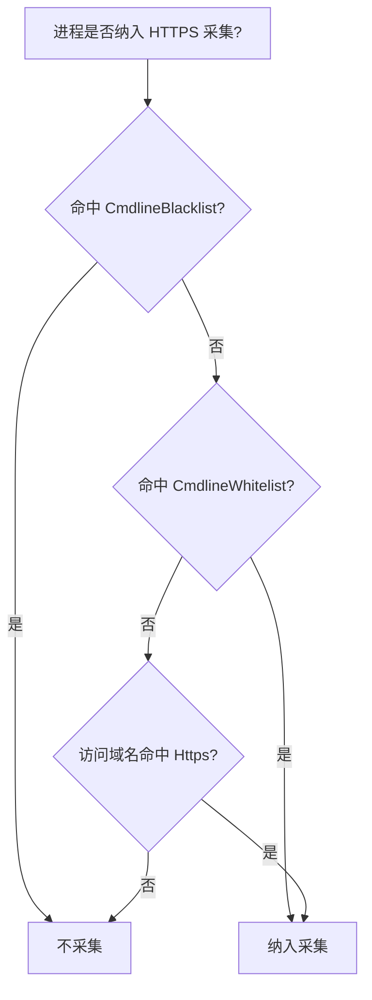
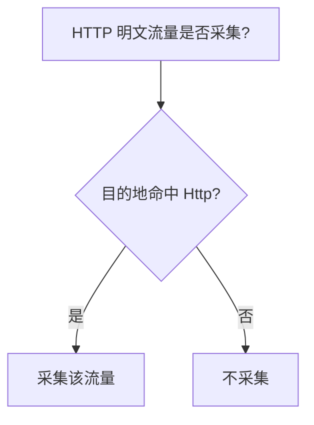

# input-agentsight 插件

## 简介

`input_agentsight` 插件实现对当前 openclaw、hermes 等 agent 工具等采集，支持的大模型供应商包括 OpenAI、Anthropic，以及国内的厂商协议。

## 事件能力

列含义见 [概览 · 事件能力列说明](../../overview.md#事件能力列说明)。

| Log | Metric | Span |
| --- | --- | --- |
| ✓ | — | — |

## 版本

dev

## 版本说明

* 推荐版本：LoongCollector v3.3.4 及以上

## 配置参数

|  **参数**  |  **类型**  |  **是否必填**  |  **默认值**  |  **说明**  |
| --- | --- | --- | --- | --- |
|  Type  |  string  |  是  |  /  |  插件类型。固定为 `input_agentsight`  |
|  ProbeConfig  |  object  |  否  |  /  |  AgentSight 探测配置。**整体未配置**时所有子项走默认。  |
|  ProbeConfig.Verbose  |  uint  |  否  |  `0`  |  是否打印 ebpf 的详细日志，`1` 代表开启，`0` 代表关闭  |
|  ProbeConfig.LogPath  |  string  |  否  |  `""`  |  ebpf 日志的输出位置  |
|  ProbeConfig.CmdlineWhitelist  |  array  |  否（**推荐填写**）  |  内置 9 条  |  进程 **agent 筛选白名单**。每一项为对象：`AgentType`（上报字段 `gen_ai.agent.type`）+ `Args`（字符串数组，与进程 cmdline 各参数（即 `argv`）按位置 glob 匹配）。**未配置**且 `CmdlineBlacklist` 也为空时注入「默认 `CmdlineWhitelist`」（见下文）；**填写后只使用用户规则**，不再叠加内置。空数组 `[]` 视为非法配置。  |
|  ProbeConfig.CmdlineBlacklist  |  array  |  否  |  /  |  进程 **agent 筛选黑名单**，每项为 glob 字符串数组（无 `AgentType`）；**命中则排除**，不采集。**优先级高于白名单**。  |
|  ProbeConfig.Https  |  array  |  否  |  内置 6 条  |  HTTPS 加密流量的域名白名单（字符串数组，glob 通配符 `*`，不区分大小写）。访问白名单内域名的进程可被识别为采集目标。未配置时注入默认列表，见下文。  |
|  ProbeConfig.Http  |  array  |  否  |  `[]`（关闭）  |  HTTP 明文流量的目标列表（字符串数组）。每项可为 `:端口`、`IP`、`IP:端口` 或域名（如 `model-svc.default.svc`、`*.internal.svc`）。**留空时不采集明文 HTTP 流量**。  |
|  ProbeConfig.EventStreamFormat  |  bool  |  否  |  `true`  |  为 `true` 时，每次 LLM 调用在同一 `PipelineEventGroup` 内输出两条日志（各有 `event.id`）：`event.name=gen_ai.model.request`（请求开始时间戳）与 `gen_ai.model.response`（请求结束时间戳）。为 `false` 时输出单条合并日志，**无** `event.name` / `event.id`。  |
|  ProbeConfig.MessageDeltaOnly  |  bool  |  否  |  `true`  |  为 `true` 时**不**输出全量 `gen_ai.input.messages`；仍输出 `gen_ai.input.messages_delta`、`gen_ai.system_instructions_hash` / `gen_ai.tool.definitions_hash`（非空时），以及 hash 相对上一轮变化时的 `gen_ai.system_instructions` / `gen_ai.tool.definitions`。为 `false` 时**每次**输出非空的全量 `gen_ai.input.messages`。**不影响** `gen_ai.output.messages`；`messages_delta` 及 session 状态维护**不受**本开关影响。  |
|  ProbeConfig.SecurityAudit  |  object  |  否  |  /  |  AgentSight 系统安全审计采集配置。使用同一个 AgentSight handle、eventfd 和 `input_agentsight` 输出链路，不创建独立 input。  |
|  ProbeConfig.SecurityAudit.Enabled  |  bool  |  否  |  `false`  |  是否订阅 AgentSight enforcer 归一化后的文件、网络、污点传播、策略判定和执行状态事件。  |
|  ProbeConfig.SecurityAudit.EnforcerSocket  |  string  |  否  |  `/run/agentsight/enforcer.sock`  |  AgentSight enforcer 本地 Unix socket。开启审计后 enforcer 暂时不可用不会中断 LLM 采集，订阅线程会持续重连。  |

### 系统安全审计事件

安全审计显式开启后，`input_agentsight` 除 LLM 日志外还会输出 `event.name=agentsight.security.<event_type>` 的单条日志。事件保留完整 JSON 于 `event.original`，并提取以下公共字段便于检索：

- `event.id`、`event.type`、`time_unix_nano`、`observed_time_unix_nano`
- `agent.id`（仅系统事件有真实 `identity.agent_id` 时）、`gen_ai.agent.type`、`gen_ai.session.id`、`gen_ai.turn.id`、`process.pid`
- 跨层关联别名：`agentsight.binding.id`、`gen_ai.conversation.id`、`gen_ai.tool.call.id`、`process.start_time`、`process.parent.pid`、`container.cgroup.id`
- 事件载荷中的标量字段以 `security.*` 前缀展开，例如 `security.policy_id`、`security.mode`、`security.risk_score`

```yaml
inputs:
  - Type: input_agentsight
    ProbeConfig:
      SecurityAudit:
        Enabled: true
        EnforcerSocket: /run/agentsight/enforcer.sock
```

该能力只负责采集 enforcer 已生成的安全事实；策略下发、阻断和案件编排不由 LoongCollector 执行。若运行时 AgentSight 动态库尚未提供 `read_v2` 安全审计 ABI，插件会告警并自动退化为原有 LLM 采集。

#### 应用层与系统层关联

上述关联字段是 `identity.*` 的确定性别名，原始 `identity.*` 仍保留在 `agentsight.identity.*` 下，完整事件仍保留在 `event.original`。LoongCollector 不补猜缺失身份，也不在采集端维护跨事件状态。

建议在 SLS 中将应用层的模型输入、工具调用或敏感数据命中事件，与系统层的文件、网络、污点传播和策略事件进行关联。高置信泄漏告警至少同时满足：

1. 应用层存在敏感数据或敏感文件证据；
2. 系统层存在同一 `agentsight.binding.id` 关联的敏感来源、出站网络去向和 `policy_decision` 证据链；
3. 两层的非空 `gen_ai.agent.type` 和 `gen_ai.session.id` 相等；工具调用触发的暴露还要求非空 `gen_ai.tool.call.id` 相等；若应用层也提供真实、稳定的 `agent.id`，则额外要求两层 `agent.id` 相等；
4. 系统层出站事件不早于应用层证据，且不晚于应用层证据 120 秒。

关联键缺失时，事件仍可作为安全证据检索，但不建议直接升级为高置信泄漏告警。`process.pid` 应与 `process.start_time` 组合使用，避免 PID 复用造成误关联；容器场景可再使用 `container.cgroup.id` 收窄范围。

`security.blocked=true` 表示执行侧阻止了本次暴露尝试，`security.blocked=false` 表示观察到高风险出站行为；两者都不能在缺少传输完成证据时表述为“已确认数据外泄”。

### `AgentType` 取值命名规范

本插件通过 **cmdline 白名单** 设置的是 **agent 类型**，命中后写入日志的 `gen_ai.agent.type` 字段。

**推荐**（非强制）的 `AgentType` 取值约定：

- 仅使用 **小写字母**、**数字**、**连字符** `-`
- 以字母或数字开头/结尾，**不**以 `-` 开头或结尾
- 多个单词用 **单个** 连字符连接，不用空格、下划线或驼峰

| 推荐 | 不推荐 |
| --- | --- |
| `openclaw` | `OpenClaw`、`open_claw` |
| `claude-code` | `Claude Code`、`claude_code` |
| `hermes` | `Hermes` |
| `cosh` | `Cosh` |
| `codex` | `Codex` |

`AgentType` 必须是**非空字符串**；具体取值不做硬校验，写什么就上报什么到 `gen_ai.agent.type`。统一遵循上述规范便于跨产品聚合分析。

### 优先级与默认值

#### 黑白名单判定逻辑

本插件有**两条独立判定链**：

- **HTTPS 加密流量** 走 **进程级判定**：由 `CmdlineBlacklist` / `CmdlineWhitelist` / `Https` 决定哪些进程被纳入采集。
- **HTTP 明文流量** 走 **目的地级判定**：由 `Http` 列表按"目的端口 / 目的 IP / 目的域名"过滤要采集的流量，与进程无关。

两条链相互独立、互不影响；同一名单内的多条规则之间为 **OR**（命中任一条即可）。

##### 1. HTTPS 加密流量采集（进程级）

进程是否纳入采集，按下列**固定顺序**判定（未配置项见下文「默认值」）：

1. 命中 `CmdlineBlacklist` → **不采集**（cmdline 黑名单优先）
2. 未命中黑名单，且命中 `CmdlineWhitelist` → **纳入采集**
3. 仍未纳入，且进程访问域名命中 `Https` → **纳入采集**
4. 以上均未命中 → **不采集**



例如：只配置了 cmdline 黑名单、未配 `Https` 时，仍会注入默认 `Https` 列表；只配 `Https`、未配 cmdline 黑白名单时，仍会注入下文的默认 cmdline 白名单。

##### 2. HTTP 明文流量采集（目的地级）

`Http` 是**纯流量白名单**，不区分进程，按目的地 `:端口` / `IP` / `IP:端口` / `域名` 命中即采集：



`Http` 列表 **为空时不采集任何明文 HTTP 流量**（默认关闭）；非空时仅采集命中目的地的流量。

#### Cmdline 规则优先级和默认注入值

1. **黑名单优先于白名单**：同一进程同时命中黑/白名单时，**黑名单生效**。
2. **多条白名单之间**：**OR**，命中任一条即可。
3. **默认注入条件**：`CmdlineWhitelist` 与 `CmdlineBlacklist` **均未配置**时，注入下表；一旦配置了 **任意一条** 用户 cmdline 白名单或黑名单，则 **不再** 注入默认 cmdline。
4. **空数组拒绝**：显式写 `CmdlineWhitelist: []` 会被视为非法配置；不写该字段才会走默认注入。

**默认 `CmdlineWhitelist`（9 条）**

| AgentType | Args（cmdline 各段 glob） |
| --- | --- |
| `hermes` | `hermes*` |
| `hermes` | `*python*`, `*hermes*` |
| `hermes` | `*python*`, `-m`, `*hermes*` |
| `cosh` | `node*`, `*/usr/bin/co*` |
| `cosh` | `node*`, `*/usr/bin/cosh*` |
| `cosh` | `node*`, `*/usr/bin/copliot*` |
| `cosh` | `node*`, `*copilot-shell*` |
| `openclaw` | `*openclaw-gatewa*` |
| `openclaw` | `node*`, `*openclaw*` |

#### 自定义示例（覆盖默认）

填写后只使用用户规则，不再叠加内置：

```yaml
ProbeConfig:
  CmdlineWhitelist:
    - AgentType: openclaw
      Args: ["node*", "*openclaw*"]
    - AgentType: claude-code
      Args: ["node*", "*claude*"]
```

#### Https 规则优先级和默认注入值

1. **多条 Https 规则之间**：**OR**，命中任一条即可。
2. **默认注入条件**：`Https` 列表 **为空** 时，注入下表；一旦配置了 **任意一条** 用户规则，则 **不再** 注入默认值。

**默认 `Https`（6 条）**

| 域名 | 说明 |
| --- | --- |
| `api.openai.com` | OpenAI |
| `api.anthropic.com` | Anthropic |
| `dashscope.aliyuncs.com` | DashScope/百炼 按量付费·华北2（北京） |
| `dashscope-intl.aliyuncs.com` | DashScope/百炼 按量付费·新加坡 |
| `dashscope-us.aliyuncs.com` | DashScope/百炼 按量付费·美国（弗吉尼亚） |
| `coding.dashscope.aliyuncs.com` | DashScope/百炼 Coding Plan |
| `*.maas.aliyuncs.com` | DashScope/百炼 业务空间专属 / 试用 / Token Plan 域名 |

> DashScope/百炼 的业务空间专属、试用与 Token Plan 均使用 `[workspace-id｜trial｜token-plan].[region].maas.aliyuncs.com` 形式的域名——`workspace-id` 与地域（`cn-beijing`、`ap-southeast-1`、`ap-northeast-1`、`eu-central-1` 等）为动态前缀，无法穷举，因此用通配 `*.maas.aliyuncs.com` 统一覆盖（glob `*` 可跨 `.`）。
>
> 通配域名仅用于 **SNI 层的 SSL/TLS 探针挂载**（HTTPS 加密流量采集主路径）；基于 TCP 连接目的 IP 的进程发现会跳过通配域名（无法 DNS 解析），对加密流量采集本身无影响。

#### Http 规则优先级和默认注入值

1. **多条 Http 条目之间**：**OR**，命中任一条即可，顺序无关。
2. **每一项**可写以下四种形态之一：
   - `:端口`（如 `:8080`）：匹配任意目的 IP + 指定端口。
   - `IP`（如 `10.0.0.1`）：匹配指定目的 IPv4 + 任意端口。
   - `IP:端口`（如 `10.0.0.1:9090`）：精确匹配目的 IPv4 + 端口。
   - `域名`（如 `model-svc.default.svc`、`*.internal.svc`）：在**运行时**根据域名解析结果动态生效。
3. **默认注入条件**：`Http` 列表 **为空** 时不注入任何默认值，明文 HTTP 流量采集**默认关闭**。

#### `gen_ai.agent.type` 的取值规则

`gen_ai.agent.type` **只来自 cmdline 白名单**（用户配置或内置默认）中命中规则的 `AgentType`，与 `Https` / `Http` 列表无直接映射关系。按下列顺序确定：

1. 进程被当前生效的 cmdline 白名单命中 → 取**第一条**命中规则的 `AgentType`。
2. 进程仅靠 `Https` 纳入采集，且 cmdline 未命中（用户已覆盖默认时）→ 二次匹配 **内置默认 9 条**；命中则输出对应类型（如 `openclaw`）。
3. 仍匹配不上 → **不输出** `gen_ai.agent.type`。

「只配 `Https`、不配 cmdline」是允许的：cmdline 走内置默认 9 条 + `Https` 走用户配置，互相独立生效。**`Https` / `Http` 列表中的条目本身不会作为** `gen_ai.agent.type`。

### Cmdline 规则自定义写法

配置里**每一项**是一条白名单规则对象，包含两个字段：

| 字段 | 说明 |
| --- | --- |
| `AgentType` | 命中该规则后，写入日志 `gen_ai.agent.type` 的类型标识（如 `openclaw`）。多条规则可使用相同 `AgentType`。取值规范见上文。 |
| `Args` | 与进程 cmdline 各参数（即 `argv`，与 `/proc/<PID>/cmdline` 一致）按位置做 glob 匹配的字符串数组。 |

先在本机查看真实命令行，再写 glob：

```bash
tr '\0' ' ' < /proc/<PID>/cmdline; echo
```

每一段用 **glob** 匹配，不关心的位置写 `"*"`。

**前缀匹配**：当 `Args` 的段数**少于** cmdline 实际参数数时，只对前 N 段按位置做 glob 匹配，**后面多出来的参数不参与匹配**。例如 `Args: ["node*", "*openclaw*"]` 可命中 `node openclaw.js gateway`（第三段 `gateway` 被忽略）。若需约束后续参数，须在 `Args` 中继续写出对应段。反之，`Args` 段数**多于** cmdline 实际参数数时则不命中。

**示例**（须写在 `ProbeConfig` 下）：

```yaml
ProbeConfig:
  CmdlineWhitelist:
    - AgentType: openclaw
      Args: ["node*", "*openclaw*"]
    - AgentType: hermes
      Args: ["*python*", "*hermes*"]
```

同一进程命中多条规则时，**采集仍生效**；`gen_ai.agent.type` 取**列表中第一条**命中规则的 `AgentType`。若需固定类型，把更具体的规则排在前面，或避免 glob 重叠。

### Https 规则自定义写法

`Https` 里每一项用于匹配进程访问的大模型 API 主机名。**默认注入为精确主机名**；自行配置时也可写 glob（如 `*.anthropic.com`），通配符为 `*`，匹配 **不区分大小写**。示例：

```yaml
Https:
  - "api.openai.com"
  - "dashscope.aliyuncs.com"
  - "*.anthropic.com"
```

### Http 规则自定义写法

`Http` 里每一项可以是 `:端口`、`IP`、`IP:端口` 或域名（含 glob），四种形态可混合书写。命中其中之一即对该明文 HTTP 流量进行采集。示例：

```yaml
Http:
  - ":8080"
  - "10.0.0.1:9090"
  - "model-svc.default.svc"
  - "*.internal.svc"
```

### Codex 采集支持说明

官方发布的 Codex CLI 是 strip 后的静态链接二进制，缺少符号表，**不支持** HTTPS 流量采集。如需采集，请使用**自行编译的未 strip 版本**（保留符号表即可自动定位 SSL 收发函数）。

### `EventStreamFormat: false`（合并日志）

一次 LLM 调用输出 **一条** 日志，同时包含请求与响应字段（见下表）。

- **无** `event.name`、**无** `event.id`
- 时间戳为**请求开始**时刻
- 同条内可有 `gen_ai.request.model`、`gen_ai.response.id`、`status_code`、`gen_ai.response.duration`、`gen_ai.response.finish_reasons`（JSON 数组）等

`Http` / `Https` 只影响**是否采集**对应流量，不改变上述合并/拆分形态。

### `EventStreamFormat: true`（默认，流式拆分）

一次 LLM 调用在同一日志组内输出 **两条** 日志，通过 `gen_ai.session.id`、`gen_ai.turn.id` 等关联：

| `event.name` | 时间戳 | 主要字段 |
| :--- | :--- | :--- |
| `gen_ai.model.request` | 请求开始时刻 | `gen_ai.input.messages`（`MessageDeltaOnly: false` 且非空时**每次**）、`gen_ai.input.messages_delta`、`gen_ai.system_instructions_hash` / `gen_ai.tool.definitions_hash`（非空时）、`gen_ai.system_instructions` / `gen_ai.tool.definitions`（hash 相对 session 上一轮变化时）、`gen_ai.request.model`、`server.*`、`time_unix_nano`、`observed_time_unix_nano` |
| `gen_ai.model.response` | 请求结束时刻（开始 + 耗时） | `gen_ai.output.messages`（始终）、`gen_ai.response.id`、`gen_ai.response.model`（非空时）、`gen_ai.response.finish_reasons`、`gen_ai.usage.*`（token，无 cost）、`status_code`、`is_sse`、`gen_ai.response.duration`、`gen_ai.provider.name` |

两条日志均可能包含：`event.id`（仅流式拆分）、`gen_ai.session.id`、`gen_ai.turn.id`、`pid`、`comm`、`cmdline`、`container.id`、`gen_ai.agent.type`、`gen_ai.provider.name`。

### 字段表（合并模式 / 拆分模式中的并集）

| 字段 | 类型 | 说明 |
| :--- | :--- | :--- |
| `event.id` | string | 本条日志的唯一标识（UUID，大写带连字符）；**仅** `EventStreamFormat: true` 时输出，request/response 各 1 个 |
| `event.name` | string | **`gen_ai.model.request`** 或 **`gen_ai.model.response`**；**仅** `EventStreamFormat: true` 时输出 |
| `gen_ai.session.id` | string | 用户的会话 id |
| `gen_ai.turn.id` | string | 同一会话中其中一次对话的 id |
| `gen_ai.response.id` | string | 一次对话中其中一次对大模型请求的回复 id |
| `pid` | string | 进程号（十进制字符串） |
| `comm` | string | 进程名称 |
| `cmdline` | string | 进程完整命令行（`argv` 空格拼接，截断到 127 字节），来自 `/proc/<PID>/cmdline`；进程已退出时为空则不输出 |
| `container.id` | string | 进程所属容器 id，由 agentsight 侧按 pid 解析；非容器进程或解析失败时为空则不输出 |
| `gen_ai.agent.type` | string | Agent **类型**（如 `openclaw`、`claude-code`），来自 cmdline 白名单 |
| `time_unix_nano` | string | 本条日志事件时刻，Unix 纪元纳秒（十进制字符串）；与 `SetLogTimestampFromNs` 所用时间戳一致 |
| `observed_time_unix_nano` | string | 观测时刻，与 `time_unix_nano` **相同**（十进制字符串） |
| `gen_ai.response.duration` | string | 一次对大模型请求到大模型回复的耗时，毫秒（十进制字符串） |
| `server.address` | string | 从请求 URL 解析出的服务端主机名（有请求 URL 时输出） |
| `server.port` | string | 从请求 URL 解析出的端口（URL 中含显式端口时输出） |
| `gen_ai.provider.name` | string | 大模型厂商名称 |
| `gen_ai.request.model` | string | 请求侧模型名；合并日志与 request 条输出 |
| `gen_ai.step.id` | string | 同一 `gen_ai.turn.id` 内每次 LLM hop 递增（`{turn.id}:s1`、`{turn.id}:s2`…）；**仅** `EventStreamFormat: true` 时输出，request 与 response **均**携带且同 hop 值相同；合并条无此字段 |
| `gen_ai.event.sequence` | string | **仅** `EventStreamFormat: true`：同一 `gen_ai.turn.id` 内按**实际落盘日志行**单调递增（request=1、response=2、request=3…）；合并条无此字段 |
| `gen_ai.response.model` | string | 响应侧模型名（非空时）；**仅** `EventStreamFormat: true` 的 response 条；合并日志**不**单独输出此字段（用 `gen_ai.request.model`） |
| `status_code` | string | 一次请求的状态码，同 HTTP 状态码（十进制字符串，如 `200`）；合并条或 response 条 |
| `is_sse` | string | 是否为 SSE（Server-Sent Events）连接；日志中取值为 `1`（是）或 `0`（否） |
| `gen_ai.response.finish_reasons` | string | 停止原因 **JSON 数组字符串**（如 `["stop"]`、`["tool_calls","stop"]`）；从 `output.messages`（含 `parts` 内）收集；仅有一个停止原因时也输出单元素数组 |
| `is_usage_from_api` | string | 数据来源标识，true 表示来自 LLM API response usage 字段（精确值），false 表示由插件本地估算（近似值） |
| `gen_ai.usage.input_tokens` | string | 发送给模型的 token 数量（十进制字符串） |
| `gen_ai.usage.output_tokens` | string | 模型实际生成的回复内容长度（十进制字符串） |
| `gen_ai.usage.total_tokens` | string | 一次请求消耗的 Token 总量（十进制字符串） |
| `gen_ai.usage.cache_creation.input_tokens` | string | 本次请求中，被系统新写入缓存的那部分输入 Token 数量（十进制字符串） |
| `gen_ai.usage.cache_read.input_tokens` | string | 本次请求中，直接从已有缓存中命中并读取的输入 Token 数量（十进制字符串） |
| `gen_ai.input.messages` | string | 当次 LLM 请求的完整 messages JSON 数组（**仅** `MessageDeltaOnly: false`，非空则**每次**输出） |
| `gen_ai.input.messages_delta` | string | 当次请求 input 相对同 session 上一轮的增量片段（JSON 数组字符串）；**不含** `role=system` 消息；非空时输出 |
| `gen_ai.system_instructions_hash` | string | 从 request messages 提取的 system 消息 JSON 数组的 SHA-256 摘要（十六进制；非空时输出；用于漂移检测） |
| `gen_ai.system_instructions` | string | 系统指令（system 角色）消息 JSON 数组字符串；**仅当** `gen_ai.system_instructions_hash` 相对同 session 上一轮变化时输出 |
| `gen_ai.tool.definitions_hash` | string | 请求 tools 定义 JSON 的 SHA-256 摘要（十六进制；非空时输出；用于漂移检测） |
| `gen_ai.tool.definitions` | string | 请求 tools 定义 JSON 数组；**仅当** `gen_ai.tool.definitions_hash` 相对同 session 上一轮变化时输出 |
| `gen_ai.output.messages` | string | 大模型回复 message 的序列化 json（**不受** `MessageDeltaOnly` 控制，非空时输出） |

本表字段在日志内容中**键值类型均为字符串**。其中带数值语义的字段以十进制文本（或 `is_sse` 的 `1`/`0`）输出。

### `MessageDeltaOnly` 与 input 字段

- `MessageDeltaOnly: true`（默认）：不输出全量 `gen_ai.input.messages`；**始终**输出 `gen_ai.input.messages_delta`（若有）、`gen_ai.system_instructions_hash` / `gen_ai.tool.definitions_hash`（非空时），以及 hash 变化时的 system/tools 全文；`gen_ai.output.messages`（若有）**不受**本开关影响。
- `MessageDeltaOnly: false`：全量 `gen_ai.input.messages` 非空时**每次**输出；system/tools 仍按 hash 变化决定是否输出全文；**不因 turn 切换而重置** session 状态（同 session 内 input 通常连续累积）。

#### 会话、`gen_ai.step.id` 与 `gen_ai.event.sequence`

- 会话级 input 关联按 **`gen_ai.session.id`** 索引（无 session 时用 `gen_ai.turn.id`）；同一会话内 **不因 turn 切换而清空**。最多保留 **4096** 个 session，超出时淘汰最久未使用的条目。
- **`gen_ai.turn.id`**：独立字段，来自 lib conversation id。
- **`gen_ai.step.id`**：格式 `{turn.id}:s{N}`（冒号分隔，如 `278a5a71…:s2`）。在同一 `gen_ai.turn.id` 内，每次 LLM hop 递增（从 `s1` 起）；**仅** `EventStreamFormat: true` 时输出，request 与 response 行均携带，同一 hop 的值相同。
- **`gen_ai.event.sequence`**：**仅** `EventStreamFormat: true`。在同一 `gen_ai.turn.id` 内，按实际输出的日志行单调递增（request=1、response=2、request=3、response=4…）；新 turn 时从 1 重新计数。合并模式（`EventStreamFormat: false`）不输出。

#### 全量 `gen_ai.input.messages`

- `MessageDeltaOnly: false`：每次 LLM 调用在 request 侧日志中输出当次完整 input 数组（非空时）。
- `MessageDeltaOnly: true`：**不**输出全量 input；仍输出 `gen_ai.input.messages_delta`（非空时）。插件内部按 session 维护上一轮条数与 H_in（role+parts 归一化）以计算 delta；H_out 仅保留 **role**（便于 response 与下一轮 replay 在 `parts`/tool_call id 等字段不一致时仍能匹配）。

#### system / tools 与 hash 去重

- `gen_ai.system_instructions_hash`：对 `ExtractSystemInstructionsJson` 提取结果的 SHA-256；**每轮**非空时输出。
- `gen_ai.tool.definitions_hash`：对 tools JSON 原文的 SHA-256；**每轮**非空时输出。
- 全文 `gen_ai.system_instructions` / `gen_ai.tool.definitions`：**仅当**对应 hash 相对同 session 上一轮变化时输出（首轮视为变化）。

字段含义见上文字段表中的 `gen_ai.input.messages`、`gen_ai.input.messages_delta`。

### `EventStreamFormat: false` 且 `MessageDeltaOnly: true`（最瘦合并日志）

- 每次 LLM 调用 **一条** 日志，**无** `event.name`、**无** `event.id`；时间戳为请求开始时刻。
- **有**：关联字段、HTTP/`usage` 元数据、`gen_ai.input.messages_delta`（非空时）、system/tools hash（非空时）、hash 变化时的 system/tools 全文、`gen_ai.output.messages`。
- **无**：全量 `gen_ai.input.messages`、拆分后的 `gen_ai.model.request` / `gen_ai.model.response`。

## 样例

### 采集 agent 与 llm 交互数据

- 输入

打开 agent 进行交流

- 采集配置

```yaml
enable: true
inputs:
  - Type: input_agentsight
    ProbeConfig:
      Verbose: 1
      LogPath: ""
      CmdlineWhitelist:
        - AgentType: openclaw
          Args: ["node*", "*openclaw*"]
      CmdlineBlacklist:
        - ["node*", "*webpack*"]
      Https:
        - "api.openai.com"
      Http:
        - ":8080"
        - "10.0.0.1:9090"
      EventStreamFormat: false
      MessageDeltaOnly: false
flushers:
  - Type: flusher_stdout
    OnlyStdout: true
    Tags: true
```

- 输出（`EventStreamFormat: false`，单条合并日志）

{
  "gen_ai.agent.type": "openclaw",
  "gen_ai.turn.id": "c47ac487c54c2da859ba2a0e873eeeae",
  "gen_ai.input.messages": [
    {
      "role": "system",
      "parts": [
        {
          "type": "text",
          "content": "You are a personal assistant running inside OpenClaw.\n## Tooling\n..."
        }
      ]
    },
    {
      "role": "user",
      "parts": [
        {
          "type": "text",
          "content": "今天晚饭吃什么？"
        }
      ]
    }
  ],
  "gen_ai.input.messages_delta": [
    {
      "role": "user",
      "parts": [
        {
          "type": "text",
          "content": "今天晚饭吃什么？"
        }
      ]
    }
  ],
  "gen_ai.system_instructions_hash": "a1b2c3d4e5f6789012345678901234567890abcdef1234567890abcdef12345678",
  "gen_ai.tool.definitions_hash": "b2c3d4e5f6789012345678901234567890abcdef1234567890abcdef1234567890",
  "gen_ai.output.messages": [
    {
      "role": "assistant",
      "parts": [
        {
          "type": "reasoning",
          "content": "说不吃米饭\n"
        },
        {
          "type": "text",
          "content": "不吃米饭啊！"
        }
      ],
      "finish_reason": "stop"
    }
  ],
  "gen_ai.tool.definitions": [
    {
      "type": "function",
      "function": {
        "name": "read",
        "description": "Read file contents",
        "parameters": {
          "type": "object",
          "properties": {
            "path": {"type": "string"}
          },
          "required": ["path"]
        }
      }
    }
  ],
  "gen_ai.provider.name": "openai",
  "gen_ai.request.model": "qwen3.5-plus",
  "time_unix_nano": "1749123456789000000",
  "observed_time_unix_nano": "1749123456789000000",
  "gen_ai.response.duration": "3548",
  "gen_ai.response.finish_reasons": "[\"stop\"]",
  "gen_ai.response.id": "chatcmpl-3cd5d2d2-d2f5-91e9-a5e4-7fb740bb47f6",
  "gen_ai.usage.cache_creation.input_tokens": "0",
  "gen_ai.usage.cache_read.input_tokens": "0",
  "gen_ai.usage.input_tokens": "27466",
  "gen_ai.usage.output_tokens": "195",
  "gen_ai.usage.total_tokens": "27661",
  "is_sse": "1",
  "is_usage_from_api": "true",
  "pid": "705127",
  "comm": "openclaw-gatewa",
  "server.address": "dashscope.aliyuncs.com",
  "server.port": "80",
  "gen_ai.session.id": "dea5eed6-4a08-436c-b117-5ea14c9de39a",
  "status_code": "200"
}

- 采集配置（`EventStreamFormat: true`，其余同上，仅改此项）

```yaml
      EventStreamFormat: true
      MessageDeltaOnly: false
```

- 输出（`EventStreamFormat: true`，同一 `gen_ai.turn.id` 下两条日志）

**`event.name` = `gen_ai.model.request`**

```json
{
  "event.id": "A1B2C3D4-E5F6-7890-ABCD-EF1234567890",
  "event.name": "gen_ai.model.request",
  "gen_ai.agent.type": "openclaw",
  "gen_ai.session.id": "dea5eed6-4a08-436c-b117-5ea14c9de39a",
  "gen_ai.turn.id": "c47ac487c54c2da859ba2a0e873eeeae",
  "gen_ai.input.messages": [
    {
      "role": "system",
      "parts": [{"type": "text", "content": "You are a personal assistant running inside OpenClaw.\n## Tooling\n..."}]
    },
    {
      "role": "user",
      "parts": [{"type": "text", "content": "今天晚饭吃什么？"}]
    }
  ],
  "gen_ai.input.messages_delta": [
    {
      "role": "user",
      "parts": [{"type": "text", "content": "今天晚饭吃什么？"}]
    }
  ],
  "gen_ai.system_instructions_hash": "a1b2c3d4e5f6789012345678901234567890abcdef1234567890abcdef12345678",
  "gen_ai.system_instructions": "{\"role\":\"system\",\"parts\":[{\"type\":\"text\",\"content\":\"You are a personal assistant...\"}]}",
  "gen_ai.tool.definitions_hash": "b2c3d4e5f6789012345678901234567890abcdef1234567890abcdef1234567890",
  "gen_ai.tool.definitions": "[{\"type\":\"function\",\"function\":{\"name\":\"read\",\"description\":\"Read file contents\"}}]",
  "gen_ai.provider.name": "openai",
  "gen_ai.request.model": "qwen3.5-plus",
  "gen_ai.step.id": "c47ac487c54c2da859ba2a0e873eeeae:s1",
  "gen_ai.event.sequence": "1",
  "time_unix_nano": "1749123456789000000",
  "observed_time_unix_nano": "1749123456789000000",
  "pid": "705127",
  "comm": "openclaw-gatewa",
  "server.address": "dashscope.aliyuncs.com",
  "server.port": "80"
}
```

**`event.name` = `gen_ai.model.response`**

```json
{
  "event.id": "F0E1D2C3-B4A5-9678-9012-3456789ABCDE",
  "event.name": "gen_ai.model.response",
  "gen_ai.agent.type": "openclaw",
  "gen_ai.session.id": "dea5eed6-4a08-436c-b117-5ea14c9de39a",
  "gen_ai.turn.id": "c47ac487c54c2da859ba2a0e873eeeae",
  "gen_ai.step.id": "c47ac487c54c2da859ba2a0e873eeeae:s1",
  "gen_ai.event.sequence": "2",
  "gen_ai.output.messages": [
    {
      "role": "assistant",
      "parts": [
        {"type": "reasoning", "content": "说不吃米饭\n"},
        {"type": "text", "content": "不吃米饭啊！"}
      ],
      "finish_reason": "stop"
    }
  ],
  "gen_ai.response.id": "chatcmpl-3cd5d2d2-d2f5-91e9-a5e4-7fb740bb47f6",
  "gen_ai.response.model": "qwen3.5-plus",
  "gen_ai.response.finish_reasons": "[\"stop\"]",
  "gen_ai.response.duration": "3548",
  "time_unix_nano": "1749123460337000000",
  "observed_time_unix_nano": "1749123460337000000",
  "gen_ai.provider.name": "openai",
  "gen_ai.usage.input_tokens": "27466",
  "gen_ai.usage.output_tokens": "195",
  "gen_ai.usage.total_tokens": "27661",
  "gen_ai.usage.cache_creation.input_tokens": "0",
  "gen_ai.usage.cache_read.input_tokens": "0",
  "is_sse": "1",
  "is_usage_from_api": "true",
  "status_code": "200",
  "pid": "705127",
  "comm": "openclaw-gatewa"
}
```
