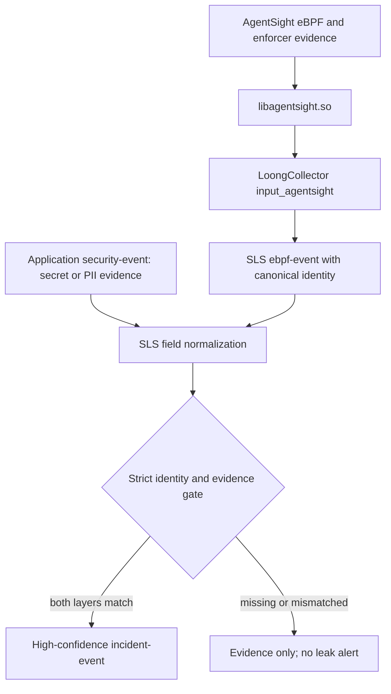

# AgentSight Cross-Layer Security Correlation Design

## 1. Background / Problem Statement

PR #2670 transports AgentSight system-audit facts through `input_agentsight`, but
the emitted log only exposes a subset of `identity` as canonical fields. Other
correlation data remains under `agentsight.identity.*`. AgentLoop's application
security events use session, conversation, tool-call, and evidence identifiers,
so a Scheduled SQL rule cannot reliably require both layers without a stable
field contract.

This design keeps LoongCollector responsible for collection and normalization.
Leak classification remains in SLS, where application evidence and system
evidence can be joined without coupling AgentLoop policy to the collector.

### 1.1 Impact Scope

- `AgentsightManager`: map security-event identity into canonical log fields.
- AgentSight input tests: verify field presence, absence, and raw-event fidelity.
- AgentSight input documentation: publish the correlation contract.
- AgentLoop Scheduled SQL: consume the contract; it is deployed outside this
  repository.

The change is additive. Existing fields, `event.original`, the FFI ABI, plugin
lifecycle, queues, and the default-disabled security-audit behavior are
unchanged.

### 1.2 Constraints

- A formal leakage incident requires application and system evidence.
- Missing correlation identifiers must not be replaced with guessed values.
- File contents, credentials, prompts, and model output must not be copied into
  system-audit identity fields.
- PID must be paired with process start time to reject PID reuse.
- LoongCollector must not contain AgentLoop alert policy or cross-event state.

## 2. Design Goals

### 2.1 Functional Goals

**Must**

- Expose `identity.conversation_id` as `gen_ai.conversation.id`.
- Expose `identity.tool_call_id` as `gen_ai.tool.call.id`.
- Expose `identity.process_start_time` as `process.start_time`.
- Expose `identity.ppid`, `cgroup_id`, and `binding_id` using stable fields.
- Preserve the complete producer payload in `event.original`.
- Omit canonical optional fields when the producer value is null or invalid.

**Should**

- Retain the existing `gen_ai.turn.id` mapping for backward compatibility.
- Document the exact SLS match requirements and degradation behavior.

### 2.2 Non-Functional Goals

- No additional thread, cache, lock, or network request in LoongCollector.
- Linear work in the number of identity fields; no measurable throughput
  regression.
- Behavior-level unit coverage for every newly mapped field.

## 3. Technical Design

### 3.1 Architecture

### 3.2 Canonical Field Contract

| AgentSight payload | LoongCollector log field | Required for strict match |
|---|---|---|
| `identity.agent_id` | `agent.id` | When application event has a stable agent ID |
| `identity.agent_name` | `gen_ai.agent.type` | Yes |
| `identity.session_id` | `gen_ai.session.id` | Yes |
| `identity.conversation_id` | `gen_ai.conversation.id` | When application event has it |
| `identity.conversation_id` | `gen_ai.turn.id` | Compatibility only |
| `identity.tool_call_id` | `gen_ai.tool.call.id` | Yes for tool-originated exposure |
| `identity.pid` | `process.pid` | System causal check |
| `identity.process_start_time` | `process.start_time` | System causal check |
| `identity.ppid` | `process.parent.pid` | Supporting evidence |
| `identity.cgroup_id` | `container.cgroup.id` | Supporting evidence |
| `identity.binding_id` | `agentsight.binding.id` | System-chain grouping |

The existing flattened `agentsight.identity.*` fields remain available. The
canonical fields are aliases for query stability, not transformed identities.

### 3.3 Strict Correlation Rule

A high-confidence outbound-exposure incident is emitted only when all of the
following hold:

1. The application event classifies content as `secret_leak` or
   `pii_exposure` in model input, model output, or tool arguments.
2. The system evidence contains an AgentSight `policy_decision` and its linked
   source and sink events describe a sensitive source followed by an outbound
   network action.
3. `gen_ai.agent.type` and `gen_ai.session.id` are non-empty and equal across
   layers. If the application event also carries a real stable `agent.id`, it
   must match as an additional narrowing predicate.
4. For tool-originated exposure, `gen_ai.tool.call.id` is non-empty and equal.
5. Application evidence time falls within the tool call, and the system sink
   occurs no earlier than the application evidence and no later than 120
   seconds after it.
6. The system chain uses one `(process.pid, process.start_time)` tuple and one
   `agentsight.binding.id`.

If a required key is missing, the records remain searchable evidence but do not
produce a formal leakage incident. A later producer can populate the already
optional AgentSight identity fields without another LoongCollector schema
change.

### 3.4 Outcome Semantics

- `security.blocked=true`: attempted exposure prevented by enforcement.
- `security.blocked=false`: high-risk outbound action observed but not blocked.
- Neither state alone proves bytes reached the destination. A product message
  must not claim confirmed exfiltration without transfer-completion evidence.

### 3.5 Error Handling and Compatibility

- Malformed JSON continues to emit the stable envelope plus `event.original`.
- Wrong JSON types do not create canonical fields.
- Older AgentSight libraries continue through the legacy read path.
- Rollback consists of reverting the additive mapping or disabling
  `ProbeConfig.SecurityAudit.Enabled`.

## 4. Unit Testing

| Case ID | Scenario | Input | Expected behavior |
|---|---|---|---|
| `AgentsightManager_HandleSecurityEvent_01` | Complete identity | All optional identity values present | All canonical aliases emitted |
| `AgentsightManager_HandleSecurityEvent_02` | Missing optional identity | Null conversation, tool, parent, and cgroup | Optional canonical aliases absent |
| `AgentsightManager_HandleSecurityEvent_03` | Invalid identity types | Strings where numeric values are required | Invalid aliases absent; raw payload retained |
| `AgentsightManager_HandleSecurityEvent_04` | Malformed event JSON | Invalid JSON | Stable envelope and original payload emitted |

The tests use the existing process-queue fixture and inspect the real emitted
`LogEvent`; no production-only testing hooks are added.
